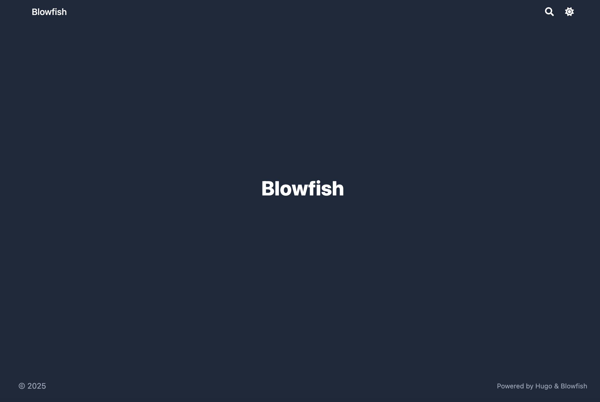
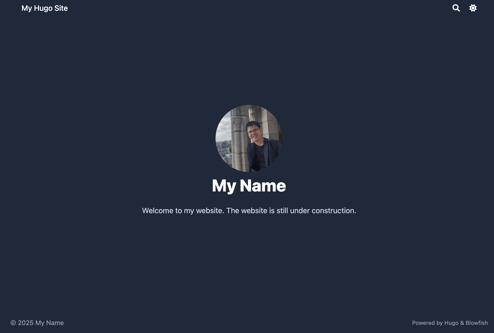
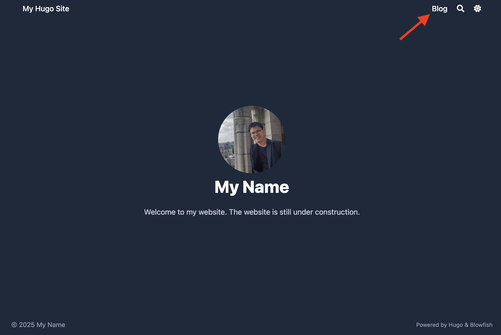
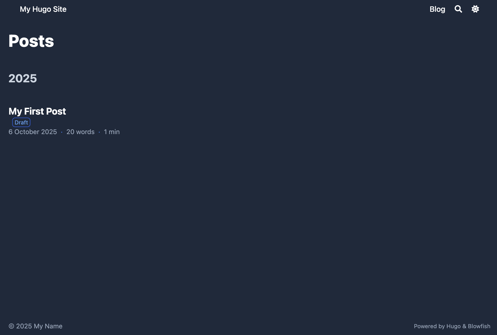
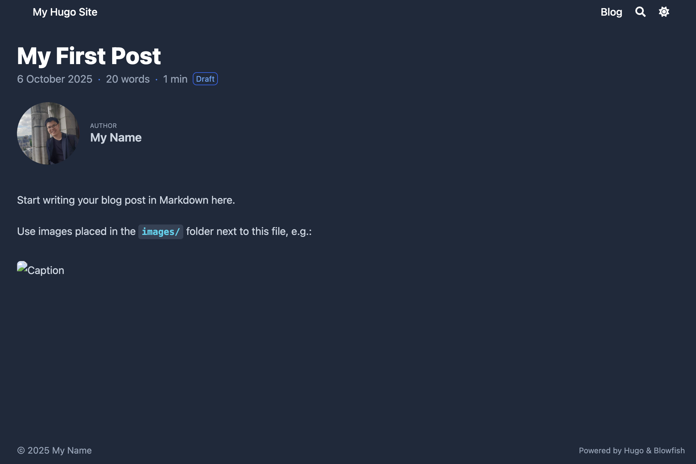
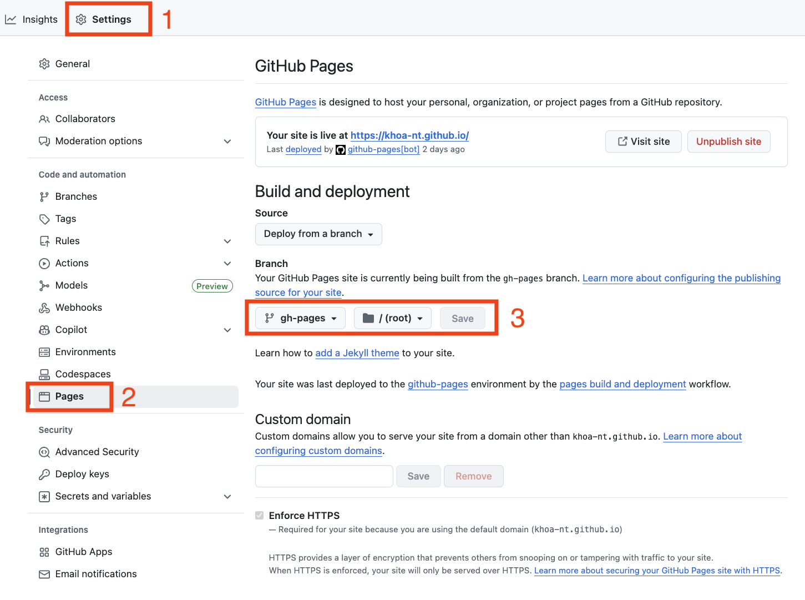
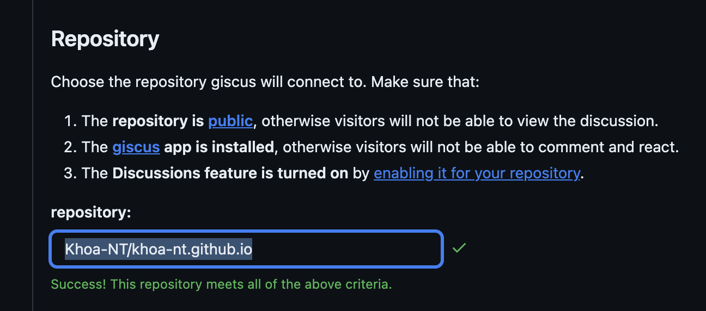
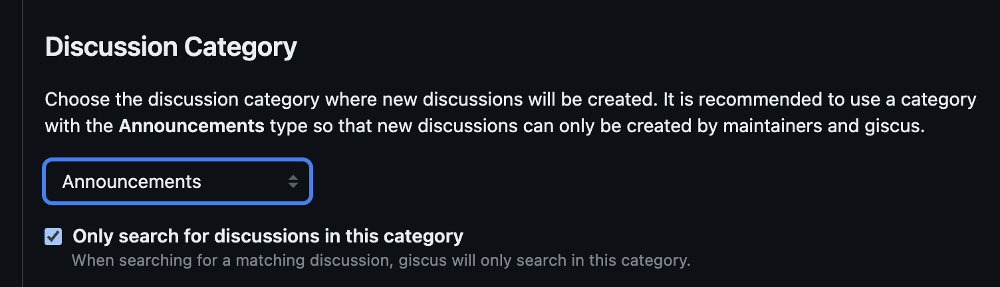
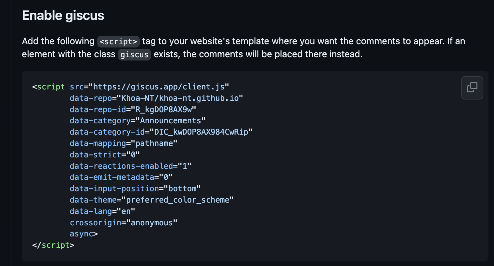

---
### Required / basic
title: "Build a Hugo Website with the Blowfish Theme (Quick Start Guide)"
date: '2025-10-06T01:04:36+09:00'                                             # sets the creation date

### Draft / publication control
draft: false                                          # mark new posts as drafts by default

### SEO / metadata
description: "A quick start guide to build and deploy a Hugo website with the Blowfish theme — from installation to comments." # short description or excerpt for meta tags

### Feature image / hero
# featureimage: "images/cover.jpg"                      # path to a feature image (optional)
# featureimagecaption: "An illustrative cover"          # caption for the feature image
# showHero: true                                        # whether to show the hero image

### Content display controls
# showDate: true                                         # show the date in the article
showReadingTime: true                                  # show estimated reading time
# showTableOfContents: false                              # whether to show a TOC in the article

### Taxonomy fields
tags: ["hugo", "blowfish", "tutorial", "quickstart"] # tags for this blog post
# series: []                                             # series name(s) if you group posts
# series_order: 1                                        # ordering in series, if used

### Comments / sharing
### Available values are: “bluesky”, “email”, “facebook”, “line”, “linkedin”, “mastodon”, “pinterest”, “reddit”, “telegram”, “twitter”, and “whatsapp”.
# showComments: false                                    # whether to include comments section
# sharingLinks: ["twitter", "linkedin", "facebook"]      # which social links to show. 

### Edit link (if your config enables showEdit)
# editURL: ""                                            # base URL for “edit this page”
# editAppendPath: true                                   # whether to append the page path to editURL
---

## Introduction

Static sites are fast, secure, and easy to host for free on GitHub Pages.
[**Hugo**](https://gohugo.io/) is one of the fastest static site generators, and [**Blowfish**](https://blowfish.page/) is a powerful, lightweight theme for Hugo.

In this quick start guide, we will:
- Setup Hugo and add the Blowfish theme
- Setup the basic configuration of the site
- Create a new post and deploy locally
- Add a comment system (Giscus)
- Deploy the site to GitHub Pages

**Note**: this guide is tested on macOS.

---

## 1. Install Hugo and Git

First, install Hugo and Git based on your platform.

### macOS

Open the terminal and run the following commands to install `hugo` and `git` using `brew`:
```bash
brew install hugo
brew install git
```

### Other Platforms
You can find detailed installation instructions for your platform in the [Hugo docs](https://gohugo.io/installation/) and [Git docs](https://git-scm.com/downloads).


### Verify the Installation

Verify by running the following command:
```bash
hugo version
```

⚠️ Make sure you are using `Hugo version 0.87.0` or later as the theme takes advantage of some of the latest Hugo features.

---

## 2. Create your Hugo site

We will create a new Hugo site named `<your-site-name>`, e.g., `my-site`.
This directory will be used to store your site's code.

### Create a new Hugo site
Run the following commands to create a new Hugo site and initialize a git repository:

```bash
hugo new site <your-site-name>
cd <your-site-name>
```

### Directory structure
⚠️ From now on, we will assume that the working directory is `<your-site-name>`.  
The directory structure should look like this:
```bash
<your-site-name>/
├── archetypes/
│   └── default.md
├── assets/
├── content/
├── data/
├── hugo.toml
├── i18n/
├── layouts/
├── static/
└── themes/
```

The explanation of the directories is in the [Hugo docs](https://gohugo.io/getting-started/directory-structure/#directories).

I know there are a lot of directories, but don't worry, in this guide, we will only focus on the following directories:
- `archetypes/`: Contains templates for new content. Refer to [Hugo docs](https://gohugo.io/content-management/archetypes/).
- `config/`: Contains the configuration files. Refer to [Hugo docs](https://gohugo.io/configuration/introduction/#configuration-directory) & [Blowfish docs](https://blowfish.page/docs/configuration/).
- `content/`: Contains the content of the site, e.g., Blog posts, About page, etc. Refer to [Hugo docs](https://gohugo.io/content-management/formats/) & [Blowfish docs](https://blowfish.page/docs/content-examples/).
- `themes/`: Contains the themes of the site. You can find other themes in [Hugo Themes](https://themes.gohugo.io/).

---

## 3. Add the Blowfish Theme

Blowfish provides a helper tool to configure everything quickly but I refer to adding the theme manually.

⚠️ Make sure the working directory is `<your-site-name>` before running the following commands.

### Initialize Git and add the Blowfish theme

```bash
git init
git submodule add -b main https://github.com/nunocoracao/blowfish.git themes/blowfish
```

### Copy the configuration files

We will use the setting provided by Blowfish, so we delete the current one created by hugo and copy the ones from the theme.
```bash
rm -rf hugo.toml
cp -r themes/blowfish/config ./
```

### Run the site locally
Run the following command to run the site locally:
```bash
hugo server -D # -D flag to run the site in draft mode
```

From the terminal, you should see the local site, e.g., `http://localhost:1313`, open it in your browser.
You should see the default Blowfish homepage like this:



Now, we are ready to configure the site in the next section.

⚠️ Keep the terminal running the `hugo server -D` command. 
It will automatically update the site when you make changes (after saving the file).
If you close the terminal, you need to run the command again to start the server.


---

## 4. Configure the Site and Homepage

The directory structure of `config/` should look like this:
```bash
<your-site-name>/
└──config/
    └── _default/
        ├── hugo.toml
        ├── languages.en.toml
        ├── markup.toml
        ├── menus.en.toml
        ├── module.toml
        └── params.toml
```


### Configure the Site

Open `config/_default/hugo.toml` and modify these lines to use the Blowfish theme and set the base URL:

```toml
theme = "blowfish" # UNCOMMENT THIS LINE AND CHANGE THIS TO "blowfish"
baseURL = "https://<your-github-username>.github.io" # CHANGE THIS TO YOUR DOMAIN according to your GitHub account name, e.g., `https://khoa-nt.github.io` is the domain for the GitHub account name "khoa-nt"
```

Refer to [Blowfish site-configuration](https://blowfish.page/docs/configuration/#site-configuration) for more details.


### Configure the Homepage

Open `config/_default/languages.en.toml` and modify these lines to set the title and author information:

```toml
title = "My Hugo Site" # Title of your site

# Uncomment this section and change the values to your own
[params.author]
    name = "My Name" # Name of the author
    image = "img/author.jpg" # Image should be placed in the `assets/` folder, e.g., `<your-site-name>/assets/img/author.jpg`
```

#### Add more details

Create `content/_index.md` and modify the content to your own. For example, I refer to the content looks like this:
```yaml
---
title: "Welcome to my website!" # For meta data
description: "This is a content of the homepage." # For meta data

### Ref:
### + Parameters: https://blowfish.page/docs/front-matter/
---

Welcome! The website is still under construction. # The text will be displayed in the homepage below the homepage image
```

You should see the homepage has been updated with your information:



Refer to [Blowfish Language Configuration](https://blowfish.page/docs/configuration/#language-configuration) for more details.


### Configure the Menu
Open `config/_default/menus.en.toml` and uncomment these lines to set the menu structure:

```toml
[[main]]
   name = "Blog"
   pageRef = "posts" ### this page will link to the `posts` directory in `content/`, e.g., `content/posts/`
   weight = 10
```

You should see the menu has been updated with the `Blog` section on the top right:




---

## 5. Create a post Template

We will create a post template in `archetypes/` to use for new posts.
Feel free to change the template to your own.
I refer to the post template looks like this:
```bash
archetypes/
├── default.md          # default template for all posts of hugo (Already exists)
└── posts/              # template for new posts (We will create this)
    ├── attachments/    # attachments for the post
    ├── images/         # images for the post
    └── index.md        # template for new posts
```

### Create empty folders and files
Open another terminal, go to `<your-site-name>` directory and run the following commands:

```bash
mkdir -p archetypes/posts/images archetypes/posts/attachments
touch archetypes/posts/index.md

touch archetypes/posts/images/.gitkeep
touch archetypes/posts/attachments/.gitkeep
```

⚠️ We will use this terminal to run the commands from now on.

### Modify the template
Open `archetypes/posts/index.md` and modify the template to your own.
I refer to the template looks like this:
```
---
### Required / basic
title: '{{ replace .File.ContentBaseName `-` ` ` | title }}'    # auto-generate title from folder name
date: '{{ .Date }}'                                             # sets the creation date

### Draft / publication control
draft: true                                          # mark new posts as drafts by default

### SEO / metadata
description: ""                                       # short description or excerpt for meta tags

### Feature image / hero
# featureimage: "images/cover.jpg"                      # path to a feature image (optional)
# featureimagecaption: "An illustrative cover"          # caption for the feature image
# showHero: true                                        # whether to show the hero image

### Content display controls
# showDate: true                                         # show the date in the article
showReadingTime: true                                  # show estimated reading time
# showTableOfContents: false                              # whether to show a TOC in the article

### Taxonomy fields
tags: []                                               # tags for this blog post
# series: []                                             # series name(s) if you group posts
# series_order: 1                                        # ordering in series, if used

### Comments / sharing
### Available values are: “bluesky”, “email”, “facebook”, “line”, “linkedin”, “mastodon”, “pinterest”, “reddit”, “telegram”, “twitter”, and “whatsapp”.
# showComments: false                                    # whether to include comments section
# sharingLinks: ["twitter", "linkedin", "facebook"]      # which social links to show. 

### Edit link (if your config enables showEdit)
# editURL: ""                                            # base URL for “edit this page”
# editAppendPath: true                                   # whether to append the page path to editURL
---

Start writing your blog post in Markdown here.

Use images placed in the `images/` folder next to this file, e.g.:


```

---

## 6. Create Your First Post

We will create a new post in `content/posts/` to test the post template.

```bash
hugo new posts/my-first-post
```

> ⚠️ You may see the warning message like this:
> ```bash
> WARN  Module "blowfish" is not compatible with this Hugo version ...
> ```
> There is no need to worry about this.
> Everything is working fine.

On your browser, you should see the post has been created by clicking the `Blog` section in the menu:



Open the post and you should see the post has been created with the default template.



---

## 7. Deploy to GitHub Pages

### Creat gitIgnore
Create `<your-site-name>/.gitignore` file and add the following content:
```bash
### Node.js dependencies directory
node_modules
### Hugo build lock file
.hugo_build.lock

### OS generated files
### macOS system file for folder display options
.DS_Store
### Alternative macOS system file
.DS_Store?
### macOS resource fork files (commented out)
# ._*
### macOS Spotlight search index
.Spotlight-V100
### macOS trash folder
.Trashes

### Hugo
### Hugo generated static site output directory
public
```

### Create a repo on GitHub
Create a new repository on your GitHub account with the name `<your-github-username>.github.io`.

⚠️ Uncheck the `Initialize this repository with a README` checkbox to avoid the `README.md` file being created.

### Add and push your site to the repo
Run the following commands to add and push your site to the repo:

```bash
git branch -M main # set the branch to main
git remote add origin https://github.com/<your-github-username>/<your-github-username>.github.io.git
git add -A # add all files to the staging area
git commit -m "Initial commit for Hugo + Blowfish site" # commit the changes
git push -u origin main # push the changes to the remote repository

```

### Add GitHub Action

Create `.github/workflows/gh-pages.yml` file and add the following content:

```yaml
# .github/workflows/gh-pages.yml

name: GitHub Pages

permissions:
  contents: write

on:
  push:
    branches:
      - main

jobs:
  build-deploy:
    runs-on: ubuntu-24.04
    concurrency:
      group: ${{ github.workflow }}-${{ github.ref }}
    steps:
      - name: Checkout
        uses: actions/checkout@v3
        with:
          submodules: true
          fetch-depth: 0

      - name: Setup Hugo
        uses: peaceiris/actions-hugo@v2
        with:
          hugo-version: "latest"

      - name: Build
        run: hugo --minify

      - name: Deploy
        uses: peaceiris/actions-gh-pages@v3
        if: ${{ github.ref == 'refs/heads/main' }}
        with:
          github_token: ${{ secrets.GITHUB_TOKEN }}
          publish_branch: gh-pages
          publish_dir: ./public
```

On your online repo, you should do the following steps:
1. Go to `Settings`
2. Go to `Pages`
3. Set the `Branch` to `gh-pages` and click `Save`




Go to your site `https://<your-github-username>.github.io`, you should see the site is deployed.
For example, `https://khoa-nt.github.io` is the domain for the GitHub account name "khoa-nt".

------

## 8. Add a Comment System (Giscus)

We will add a comment system to the site using [Giscus](https://giscus.app/).

### Enable Giscus
Go to [giscus app](https://github.com/apps/giscus) and enable it only for your site repository.

### Configure Giscus
Go to [Giscus](https://giscus.app/) and follow the instructions to get the code:



In the end, you should see the html `<script>` looks like this:


### Add the html `<script>` to the site

Create `<your-site-name>/layouts/partials/comments.html`, add the html `<div>` and your html `<script>` to the file.
```html
<!-- Add class `giscus` so that Giscus can be displayed -->
<div class="giscus"></div>

<!-- PUT YOUR HTML `<script>` HERE -->
```

Refer to [Blowfish Comments Configuration](https://blowfish.page/docs/partials/#comments) for more details.

Now comments appear under each post.

## 9. Wrap-Up and Next Steps

🎉 Congratulations! You now have a **live Hugo + Blowfish** website hosted for free.

**Next ideas:**
- Customize colors and fonts.
- Add your publications page.
- Write blog posts from Markdown or Jupyter notebooks.


## 10. Reference

- [Blowfish Documentation](https://blowfish.page/docs/)
- [Hugo Documentation](https://gohugo.io/documentation/)
- [Giscus](https://github.com/giscus/giscus?tab=readme-ov-file#giscus)


Please leave your feedback or questions in the comments section below.

Thank you for reading!


